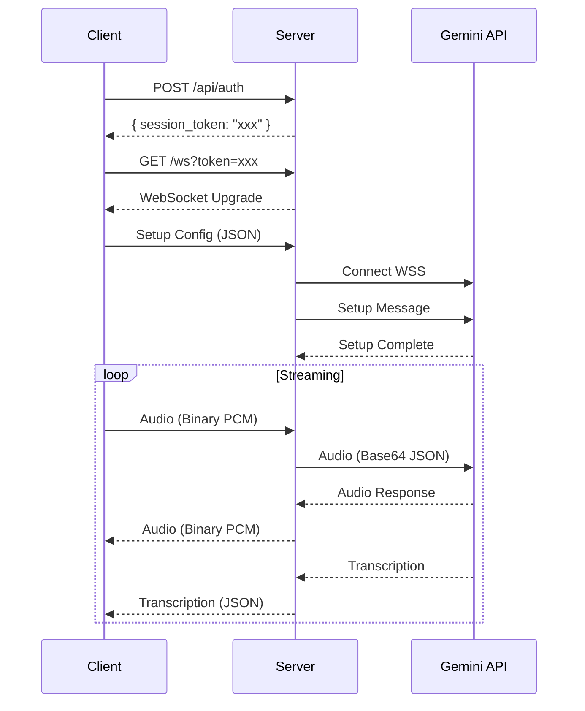

# Gemini Live API - Rust Server

A high-performance Rust server that proxies WebSocket connections between browser clients and Google's Gemini Live API. This is a drop-in replacement for the Python FastAPI server.

## Table of Contents

- [Architecture](#architecture)
- [API Reference](#api-reference)
- [Gemini Live API Protocol](#gemini-live-api-protocol)
- [Configuration](#configuration)
- [Development](#development)
- [Migration from Python](#migration-from-python)

---

## Architecture

```
┌─────────────────┐                           ┌──────────────────┐
│  Browser/Client │                           │  Gemini Live API │
│                 │                           │  (Google Cloud)  │
└────────┬────────┘                           └────────▲─────────┘
         │                                             │
         │ WebSocket                                   │ WebSocket (WSS)
         │ ws://server/ws                              │ tokio-tungstenite
         │                                             │
         ▼                                             │
┌─────────────────────────────────────────────────────┴──────────┐
│                        Rust Server (Axum)                       │
│                                                                 │
│  ┌─────────────┐    ┌─────────────┐    ┌─────────────────────┐ │
│  │ Auth Handler│    │ WS Handler  │    │ GeminiLiveClient    │ │
│  │ POST /auth  │    │ GET /ws     │    │                     │ │
│  └─────────────┘    └──────┬──────┘    │ - Setup session     │ │
│                            │           │ - Proxy audio/text  │ │
│                            │           │ - Forward responses │ │
│                     ┌──────▼──────┐    └─────────────────────┘ │
│                     │ mpsc channels│                            │
│                     │ audio_tx/rx │                            │
│                     │ text_tx/rx  │                            │
│                     │ event_tx/rx │                            │
│                     └─────────────┘                            │
└────────────────────────────────────────────────────────────────┘
```

### Data Flow

1. **Authentication**: Client calls `POST /api/auth` to get a one-time session token
2. **WebSocket Connect**: Client connects to `/ws?token={token}`
3. **Setup**: Client sends initial configuration (system prompt, voice, tools)
4. **Streaming**: Bidirectional audio/text streaming via WebSocket
5. **Events**: Server forwards transcriptions, tool calls, and status events

---

## API Reference

### `POST /api/auth`

Issue a temporary session token for WebSocket authentication.

**Request**: No body required

**Response**:
```json
{
  "session_token": "550e8400-e29b-41d4-a716-446655440000",
  "session_time_limit": 180
}
```

**Notes**:
- Token expires after 30 seconds
- Token is single-use (consumed on WebSocket connect)

---

### `GET /api/health`

Health check endpoint.

**Response**:
```json
{
  "status": "ok",
  "model": "gemini-2.0-flash-live-001"
}
```

---

### `GET /ws`

WebSocket endpoint for Gemini Live API streaming.

**Query Parameters**:

| Parameter | Required | Description |
|-----------|----------|-------------|
| `token` | Yes | Session token from `/api/auth` |

**Connection Flow**:



---

## WebSocket Message Types

### Client → Server

#### 1. Setup Configuration (First Message)

```json
{
  "setup": {
    "generation_config": {
      "response_modalities": ["AUDIO"],
      "speech_config": {
        "voice_config": {
          "prebuilt_voice_config": {
            "voice_name": "Aoede"
          }
        }
      }
    },
    "system_instruction": {
      "parts": [{ "text": "You are a helpful language tutor." }]
    },
    "tools": {
      "function_declarations": [
        {
          "name": "get_weather",
          "description": "Get current weather",
          "parameters": {
            "type": "object",
            "properties": {
              "location": { "type": "string" }
            }
          }
        }
      ]
    },
    "input_audio_transcription": true,
    "output_audio_transcription": true
  }
}
```

#### 2. Audio Data (Binary)

Raw PCM audio: **16-bit, 16kHz, mono**

#### 3. Text Message (JSON)

```json
{
  "type": "text",
  "text": "Hello, how are you?"
}
```

#### 4. Image Data (JSON)

```json
{
  "type": "image",
  "data": "<base64-encoded-jpeg>"
}
```

---

### Server → Client

#### 1. Audio Data (Binary)

Raw PCM audio: **16-bit, 24kHz, mono**

#### 2. Transcription Event (JSON)

```json
{
  "serverContent": {
    "inputTranscription": {
      "text": "Hello how are you",
      "finished": true
    }
  }
}
```

```json
{
  "serverContent": {
    "outputTranscription": {
      "text": "I'm doing great, thank you!",
      "finished": true
    }
  }
}
```

#### 3. Turn Complete (JSON)

```json
{
  "serverContent": {
    "turnComplete": true
  }
}
```

#### 4. Interrupted (JSON)

```json
{
  "serverContent": {
    "interrupted": true
  }
}
```

#### 5. Tool Call (JSON)

```json
{
  "toolCall": {
    "functionCalls": [
      {
        "name": "get_weather",
        "id": "call_123",
        "args": { "location": "Tokyo" }
      }
    ]
  }
}
```

---

## Gemini Live API Protocol

### Endpoint

```
wss://generativelanguage.googleapis.com/ws/google.ai.generativelanguage.v1alpha.GenerativeService.BidiGenerateContent?key={API_KEY}
```

### Important Protocol Details

> **Critical**: Gemini sends all WebSocket messages as **Binary frames**, not Text frames.
> The binary content is JSON encoded as UTF-8 bytes.

| Direction | WebSocket Frame Type | Content Format | Field Naming |
|-----------|---------------------|----------------|--------------|
| Client → Gemini | Text | JSON | snake_case |
| Gemini → Client | **Binary** | JSON (UTF-8 bytes) | camelCase |

Example of receiving a message from Gemini:
```rust
// Gemini sends: Binary([123, 10, 32, ...])  // UTF-8 bytes of JSON
// Must parse as: String::from_utf8(data) -> JSON with camelCase fields

// Response JSON uses camelCase:
{
  "serverContent": {
    "modelTurn": {
      "parts": [{
        "inlineData": {
          "mimeType": "audio/pcm;rate=24000",
          "data": "<base64>"
        }
      }]
    }
  }
}
```

### Authentication Methods

| Method | Use Case | Implementation |
|--------|----------|----------------|
| **API Key** | Development, simple deployments | Query parameter: `?key={API_KEY}` |
| Ephemeral Token | Client-side connections | Short-lived token from backend |
| Vertex AI | Production (GCP) | OAuth2 bearer token |

### Message Format (Server ↔ Gemini)

#### Setup Message (snake_case - sent as Text frame)

```json
{
  "setup": {
    "model": "models/gemini-2.0-flash-live-001",
    "generation_config": {
      "response_modalities": ["AUDIO"],
      "speech_config": {
        "voice_config": {
          "prebuilt_voice_config": {
            "voice_name": "Aoede"
          }
        }
      }
    },
    "system_instruction": {
      "parts": [{ "text": "System prompt here" }]
    }
  }
}
```

#### Realtime Audio Input (snake_case - sent as Text frame)

```json
{
  "realtime_input": {
    "audio": {
      "mime_type": "audio/pcm;rate=16000",
      "data": "<base64-encoded-pcm>"
    }
  }
}
```

#### Server Response (camelCase - received as Binary frame)

> **Note**: Gemini returns responses as Binary WebSocket frames containing UTF-8 JSON with camelCase field names.

```json
{
  "serverContent": {
    "modelTurn": {
      "parts": [{
        "inlineData": {
          "mimeType": "audio/pcm;rate=24000",
          "data": "<base64-encoded-pcm>"
        }
      }]
    },
    "inputTranscription": { "text": "..." },
    "outputTranscription": { "text": "..." },
    "turnComplete": true
  }
}
```

### Audio Specifications

| Direction | Sample Rate | Bit Depth | Channels | Format |
|-----------|-------------|-----------|----------|--------|
| Input (Client → Gemini) | 16 kHz | 16-bit | Mono | PCM |
| Output (Gemini → Client) | 24 kHz | 16-bit | Mono | PCM |

### Available Voices

| Voice Name | Description |
|------------|-------------|
| Aoede | Female, warm |
| Charon | Male, deep |
| Fenrir | Male, energetic |
| Kore | Female, professional |
| Puck | Male, friendly |

---

## Configuration

### Environment Variables

| Variable | Required | Default | Description |
|----------|----------|---------|-------------|
| `GOOGLE_API_KEY` | Yes* | - | Gemini API key |
| `PROJECT_ID` | No | - | GCP Project ID (for Vertex AI) |
| `LOCATION` | No | `us-central1` | GCP region |
| `MODEL` | No | `gemini-2.0-flash-live-001` | Gemini model |
| `PORT` | No | `8000` | Server port |
| `SESSION_TIME_LIMIT` | No | `180` | Max session duration (seconds) |

*Required when using API key authentication

### Example `.env`

```env
GOOGLE_API_KEY=your-api-key-here
MODEL=gemini-2.0-flash-live-001
PORT=8000
SESSION_TIME_LIMIT=180
RUST_LOG=server_rs=debug,tower_http=debug
```

---

## Development

### Prerequisites

- Rust 1.75+ (install via [rustup](https://rustup.rs/))
- Google API Key with Gemini access

### Build & Run

```bash
# Development
cd packages/server-rs
cargo run

# Release build
cargo build --release
./target/release/server-rs

# With logging
RUST_LOG=debug cargo run
```

### Project Structure

```
packages/server-rs/
├── Cargo.toml              # Dependencies and metadata
├── src/
│   ├── main.rs             # Entry point, router setup
│   ├── config.rs           # Configuration from env
│   ├── error.rs            # Error types
│   ├── state.rs            # Application state (tokens)
│   ├── handlers/
│   │   ├── mod.rs
│   │   ├── auth.rs         # POST /api/auth
│   │   ├── health.rs       # GET /api/health
│   │   └── websocket.rs    # GET /ws (WebSocket handler)
│   └── gemini/
│       ├── mod.rs          # Gemini module docs
│       ├── client.rs       # GeminiLiveClient
│       └── messages.rs     # Message types (serde)
└── README.md
```

---

## Migration from Python

### Comparison Table

| Python (FastAPI) | Rust (Axum) |
|------------------|-------------|
| `asyncio.Queue` | `tokio::sync::mpsc::channel` |
| `async for` generator | `tokio_stream` / `Stream` trait |
| `@app.websocket("/ws")` | `axum::extract::WebSocketUpgrade` |
| `google.genai` SDK | `tokio-tungstenite` direct WebSocket |
| `async with session.connect()` | `connect_async().await` |
| `await session.send_realtime_input()` | `ws_sender.send(Message::Text(...))` |

### Key Differences

1. **SDK vs Raw WebSocket**: Python uses the `google-genai` SDK; Rust uses raw WebSocket with `tokio-tungstenite`

2. **WebSocket Frame Type**:
   - Python SDK abstracts this away completely
   - Rust must handle that **Gemini sends JSON as Binary WebSocket frames** (not Text)
   - All binary frames from Gemini are UTF-8 JSON that must be parsed

3. **JSON Field Naming Convention**:
   - Input to Gemini: `snake_case` (e.g., `generation_config`, `system_instruction`)
   - Output from Gemini: `camelCase` (e.g., `serverContent`, `modelTurn`, `inlineData`)
   - Python SDK handles this mapping internally
   - Rust requires separate struct definitions with appropriate `#[serde(rename_all)]` attributes

4. **Message Encoding**:
   - Python SDK handles base64 encoding internally
   - Rust implementation explicitly encodes/decodes audio data

5. **Error Handling**:
   - Python uses exceptions
   - Rust uses `Result<T, E>` with `thiserror`

6. **Concurrency Model**:
   - Python: `asyncio` with single-threaded event loop
   - Rust: `tokio` with work-stealing multi-threaded runtime

---

## Troubleshooting

### No audio playback / Jittery sound

**Symptom**: Client receives data but `AudioPlayer.ts` throws errors like:
```
RangeError: byte length of Int16Array should be a multiple of 2
```

**Causes & Solutions**:

1. **Binary frames treated as raw audio**: Gemini sends JSON as Binary WebSocket frames. Don't treat binary data as raw PCM audio - parse it as UTF-8 JSON first.

2. **JSON field name mismatch**: Gemini responses use camelCase (`serverContent`, `inlineData`, `mimeType`). Use `#[serde(rename_all = "camelCase")]` on response structs.

3. **Odd byte length**: PCM16 audio requires even byte length. Pad with zero if needed:
   ```rust
   if audio_data.len() % 2 != 0 {
       audio_data.push(0);
   }
   ```

### No messages received from Gemini

**Symptom**: Setup succeeds but no audio responses.

**Check**:
1. Verify binary messages are being parsed as JSON (not ignored)
2. Check `RUST_LOG=server_rs=debug` for detailed message flow
3. Ensure audio is being sent to Gemini (check for `🎤 Received audio chunk` logs)

### Setup fails silently

**Symptom**: Connection established but no `setupComplete` response.

**Check**:
1. Gemini returns setup response as Binary frame (not Text)
2. Parse the binary data as UTF-8 JSON
3. Verify API key is valid and has Gemini Live API access

---

## References

- [Gemini Live API Documentation](https://ai.google.dev/api/multimodal-live)
- [Axum Web Framework](https://docs.rs/axum/latest/axum/)
- [tokio-tungstenite](https://docs.rs/tokio-tungstenite/latest/tokio_tungstenite/)
- [Gemini API Models](https://ai.google.dev/gemini-api/docs/models/gemini)

---

## License

Apache-2.0 (matching the original Python implementation)
